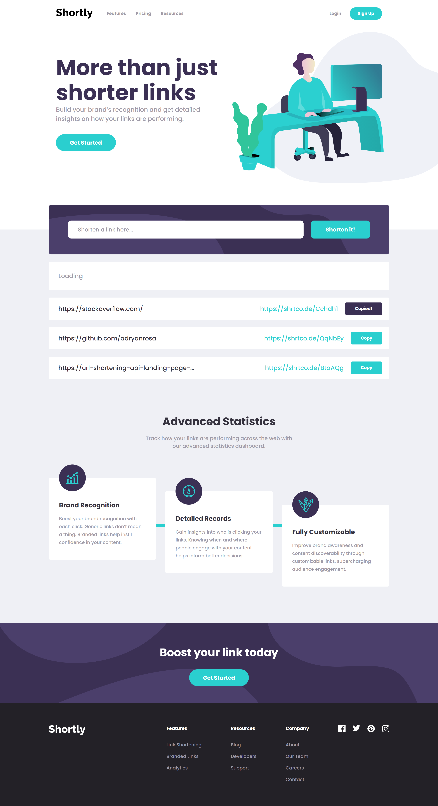

# Frontend Mentor - Shortly URL shortening API
[](https://github.com/adryanrosa/url-shortening-api-landing-page/blob/main/README.md)

This is a solution to the [Shortly URL shortening API Challenge](https://www.frontendmentor.io/challenges/url-shortening-api-landing-page-2ce3ob-G) challenge on [Frontend Mentor](https://www.frontendmentor.io).

## Table of contents

- [Overview](#overview)
  - [Live site and instructions](#live-site-and-instructions)
  - [The challenge](#the-challenge)
  - [Screenshot](#screenshot)
- [My process](#my-process)
  - [Built with](#built-with)
  - [Useful resources](#useful-resources)
  <!-- - [O que aprendi](#o-que-aprendi)
  - [Desenvolvimento contínuo](#desenvolvimento-contínuo) -->
<!-- - [Autor](#autor) -->

## Overview

### Live site and instructions

- Please visit my application [at](https://url-shortening-api-landing-page-adryanrosa.vercel.app/)
- Want to check it locally? Follow the steps
  1. Clone the repository
    * `git clone git@github.com:adryanrosa/url-shortening-api-landing-page.git`.
    * Enter the cloned repository folder:
     * `cd url-shortening-api-landing-page`

  2. Install the dependencies and start the project
    * Install the dependencies:
     * `npm install`
    * Start the project:
     * `npm run dev` (a new tab should open in your default browser)

### The challenge

Users should be able to:

- View the optimal layout for the site depending on their device's screen size
- Shorten any valid URL
- See a list of their shortened links, even after refreshing the browser
- Copy the shortened link to their clipboard in a single click
- Receive an error message when the `form` is submitted if:
  - The `input` field is empty

### Screenshot



## My process

### Built with

- [React](https://reactjs.org/) - Frontend JavaScript library
- [Sass](https://sass-lang.com/) - CSS preprocessor
- [BEM](http://getbem.com/introduction/) - CSS methodology
- Mobile-first Workflow

### Useful resources

- [Sass Masterclass - Rocketseat](https://www.youtube.com/watch?v=BaI8dHUthLA) - This masterclass helped understand @mixins, @include, @extends, etc. Sass features to avoid repetition and improve the project organization. Will keep using them going forward

<!-- ### O que aprendi

Use this section to recap over some of your major learnings while working through this project. Writing these out and providing code samples of areas you want to highlight is a great way to reinforce your own knowledge.

To see how you can add code snippets, see below:

```html
<h1>Some HTML code I'm proud of</h1>
```
```css
.proud-of-this-css {
  color: papayawhip;
}
```
```js
const proudOfThisFunc = () => {
  console.log('🎉')
}
```

### Desenvolvimento contínuo

Use this section to outline areas that you want to continue focusing on in future projects. These could be concepts you're still not completely comfortable with or techniques you found useful that you want to refine and perfect. -->

<!-- ## Autor

- Website - [Add your name here](https://www.your-site.com)
- Frontend Mentor - [@yourusername](https://www.frontendmentor.io/profile/yourusername)
- Twitter - [@yourusername](https://www.twitter.com/yourusername) -->
