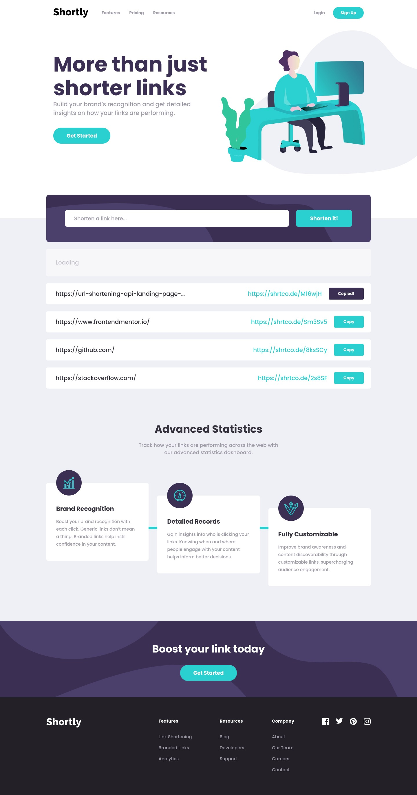

# Frontend Mentor - Shortly URL shortening API

Essa é uma solução do desafio [Shortly URL shortening API](https://www.frontendmentor.io/challenges/url-shortening-api-landing-page-2ce3ob-G) por [Frontend Mentor](https://www.frontendmentor.io).

## Sumário

- [Visão geral](#visão-geral)
  - [Live site](#live-site)
  - [O desafio](#o-desafio)
  - [Screenshot](#screenshot)
- [A proposta](#a-proposta)
  - [Feito com ](#feito-com)
  <!-- - [O que aprendi](#o-que-aprendi)
  - [Desenvolvimento contínuo](#desenvolvimento-contínuo) -->
  - [Recursos úteis](#recursos-úteis)
<!-- - [Autor](#autor) -->

## Visão geral

### [Live site](https://url-shortening-api-landing-page-adryanrosa.vercel.app/)

### A proposta

Usuários devem ser capazes de:

<!-- - View the optimal layout for the site depending on their device's screen size -->
- Encurtar qualquer URL válida
- Ver a lista de links encurtados
- Copiar o link encurtado com apenas um click
- Receber uma mensagem de erro quando o `form` é submetido se:
  - O campo `input` estiver vazio
  - O campo `input` estiver preenchido com um link inválido

### Screenshot



<!-- Add a screenshot of your solution. The easiest way to do this is to use Firefox to view your project, right-click the page and select "Take a Screenshot". You can choose either a full-height screenshot or a cropped one based on how long the page is. If it's very long, it might be best to crop it.

Alternatively, you can use a tool like [FireShot](https://getfireshot.com/) to take the screenshot. FireShot has a free option, so you don't need to purchase it. 

Then crop/optimize/edit your image however you like, add it to your project, and update the file path in the image above. -->

## O processo

### Feito com

- [React](https://reactjs.org/) - JavaScript Frontend Framework
- [Sass](https://sass-lang.com/) - Pré-processador CSS
- Workflow Mobile-first
- [BEM](http://getbem.com/introduction/) - Metodologia CSS 

<!-- ### O que aprendi

Use this section to recap over some of your major learnings while working through this project. Writing these out and providing code samples of areas you want to highlight is a great way to reinforce your own knowledge.

To see how you can add code snippets, see below:

```html
<h1>Some HTML code I'm proud of</h1>
```
```css
.proud-of-this-css {
  color: papayawhip;
}
```
```js
const proudOfThisFunc = () => {
  console.log('🎉')
}
```

### Desenvolvimento contínuo

Use this section to outline areas that you want to continue focusing on in future projects. These could be concepts you're still not completely comfortable with or techniques you found useful that you want to refine and perfect. -->

### Recursos úteis

- [Sass Masterclass - Rocketseat](https://www.youtube.com/watch?v=BaI8dHUthLA) - Essa aula me ajudou a entender @mixins, @include, @extends, etc. funcionalidades e padrões do Sass para facilitar a organização do projeto e evitar repetições. Continuarei os usando daqui pra frente.

<!-- ## Autor

- Website - [Add your name here](https://www.your-site.com)
- Frontend Mentor - [@yourusername](https://www.frontendmentor.io/profile/yourusername)
- Twitter - [@yourusername](https://www.twitter.com/yourusername) -->
